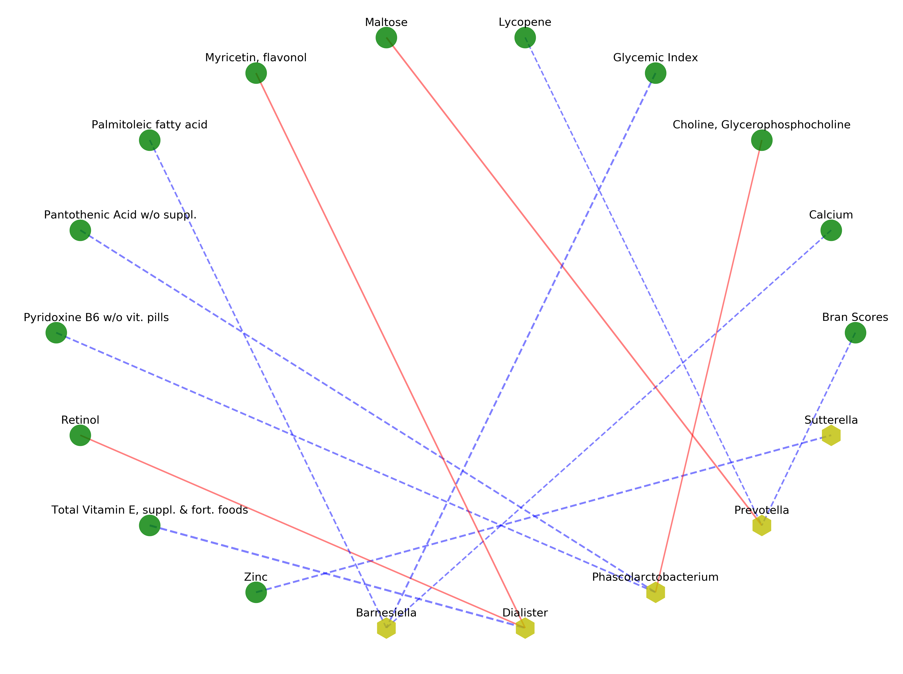

# Variational Bayes  Dirichlet Multinomial model using non-local prior spike-and-slab regression.
This repository contains TensorFlow implementation of a variational Bayes approach to variable selection using Dirichlet Multinomial model. We illustrate the approach using both simulation and real data experiments. 
 

## Introduction 

### Dirchlet Multinomial Model
Suppose we have multivariate counts  as response  data: , e.g. microbiome count data. We can model the counts using a multinomial distribution parametrized by a vector . Further, to account for the overdispersion of the response, we assume:
 
 , where .
Further, to model and identify important associations between the response data and covariates, we assume: 
 
 

A non-local prior density is used on  . Posterior inference is conducted through variational methods, which are more scalable than MCMC methods. We show a comparison with the MCMC implementation by Wadsworth et al. (2016) and a group LASSO penalized likelihood approach (Chen and Li, 2013).


## Dependencies:


numpy  1.16.2

scipy 1.2.1

pandas 0.24.2

sklearn 0.20.3

matplotlib 3.0.3

[TensorFlow: 1.13.1](https://www.tensorflow.org/install)

[networkx 2.2](https://networkx.github.io/documentation/stable/install.html)

You can either download the ZIP file or git clone the project on your local machine. Then it is recommended to use [PyCharm](https://www.jetbrains.com/pycharm/download/#section=mac), which gives a convenient one-step solution to install all the 
dependencies within this project. After opening the project in PyCharm, find the project interpreter and you can add the above packages by searching for the available packages. All the above packages are available for direct 
installation in PyCharm. 


## Running examples

**Simulations**

The data generating mechanism follows previous [work](https://github.com/duncanwadsworth/dmbvs) on Dirichlet Multinomial regression. The R code for generating data is in './data/R-code-simulate-data.R'. Running the R code will generate covariate as well as response data and write them into [h5 file](https://en.wikipedia.org/wiki/Hierarchical_Data_Format). 
We also provide simulated data file in './data/rep_50_001.h5' for overdispersion 0.01, and 'rep_50_01.h5' for overdispersion 0.1. 


For p=q=50, run 50 repeated experiments.  To start running and to return [precision, recall, MCC, AUC, F1, ACC] after finishing each repeated experiments on simulated data, 
type:


```
python train-DirMulVI.py 
```

In addition, you can find visualized results of the running example in the ipython notebook provided: non-local-prior-DMVS-SimulationExp.ipynb.
It contains ROC-AUC plots showing comparison of other methods, including MCMC methods and group LASSO penalized likelihood method. 

**Real Data Experiment**

We apply our variational method with non-local prior to a human gut microbiome
dataset, which has been previously used in Wu et al., 2011 to investigate the association of dietary
and environmental variables with the gut microbiota. 

To run the experiment, type:
```bash
python train-VI-RealData.py

```
It will return a bipartite graph indicating the selected associations based on a Bayesian false discovery rate control of 0.1. 

<p align="center">

</p>
